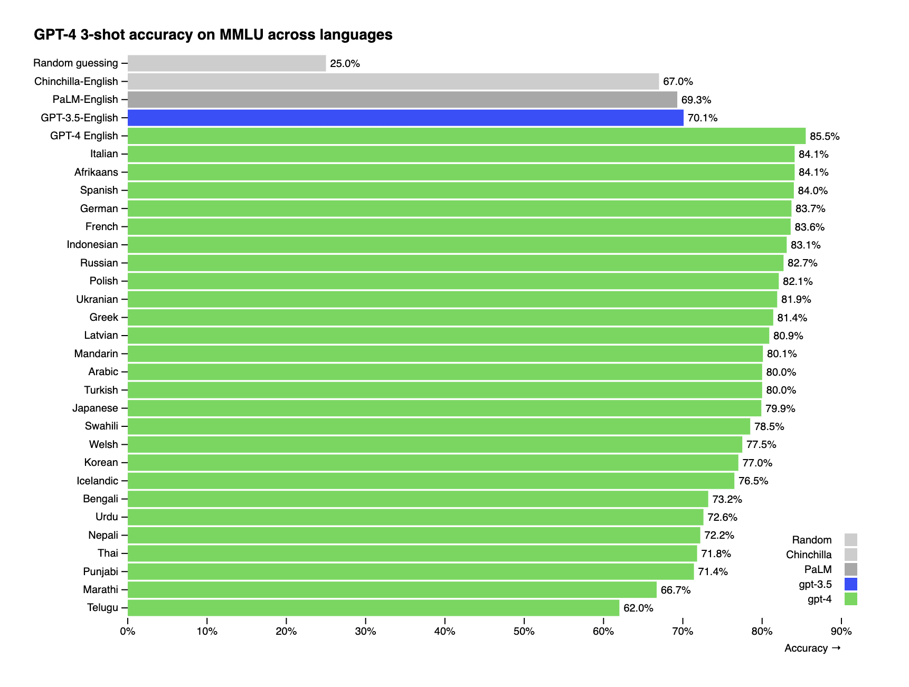

# LLM Translate

[](https://npmjs.org/package/llm-translate)

Translate text using an LLM API.

## Supported LLM APIs

- [OpenAI's GPT-3.5 (gpt-3.5-turbo)](https://openai.com/blog/openai-api)
- [OpenAI's GPT-4 (gpt-4)](https://openai.com/blog/openai-api)

## Installation

```sh
npm install llm-translate
# or
yarn add llm-translate
```

## Usage

```js
import { OpenAITranslator } from 'llm-translate';

const translator = new OpenAITranslator({
  apiKey: '',
})

const text = 'Send';
const sourceLanguage = 'en';
const targetLanguage = 'es';
const options = {
  context: 'This is a button in a user interface.',
}
const openaiOptions = {
  model: 'gpt-4',
  temperature: 0.3,
}

translator.translate(text, sourceLanguage, targetLanguage, options, openaiOptions)
  .then((translation) => {
    console.log(translation);
  })
  .catch((error) => {
    console.error(error);
  });
```

## Supported Languages

All [ISO 639-1](https://en.wikipedia.org/wiki/ISO_639-1) language codes can be passed into the LLM. The quality of translations will be lower for languages that are less common on the internet.

## LLM Performance

The GPT-4 MMLU case study from OpenAI is a good example of relative performance you might expect. [The image below shows the performance on a complex test, the MMLU](https://openai.com/research/gpt-4). As you can see, less common languages will have lower performance than more common languages.

**(This is not an image of translation performance. The translation performance will be higher than this.)**

